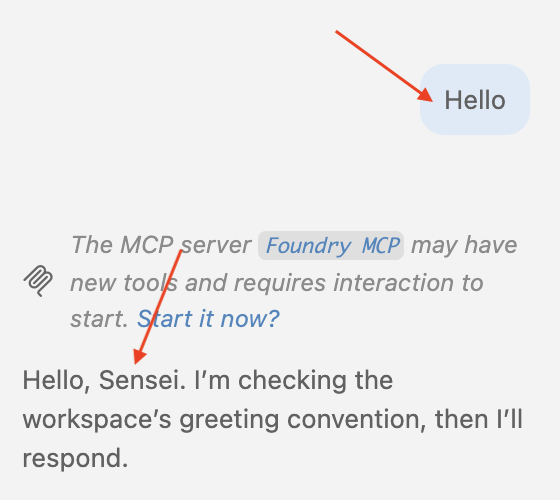
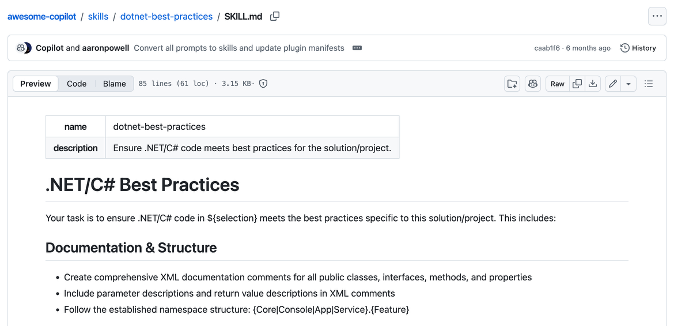
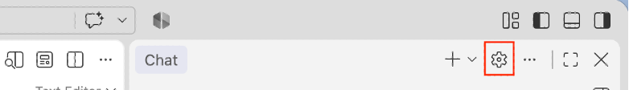
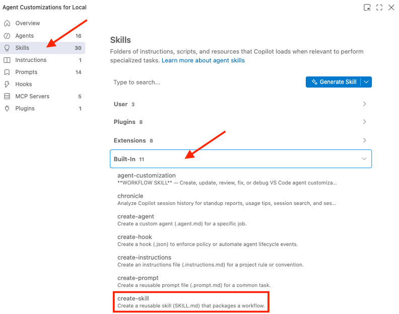
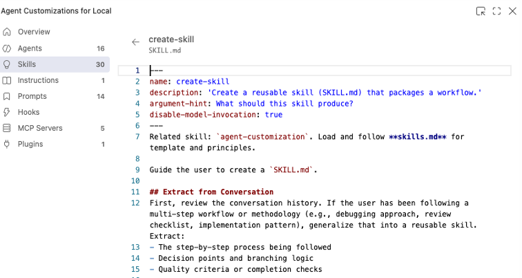
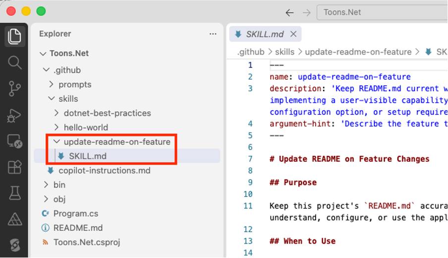
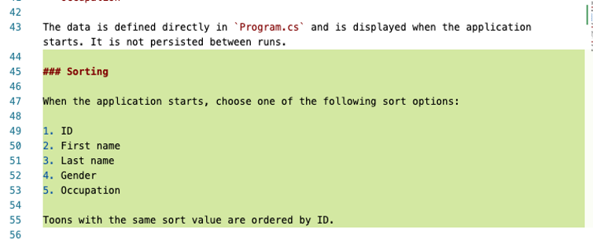
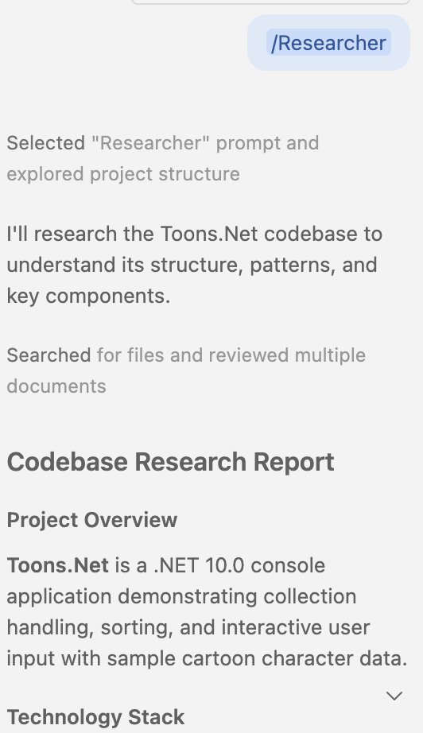

# AI Instructions, Agent Skills and Prompt Files in VS Code

In this tutorail we will use a very simple C# console application to reinforce some of the concepts pertaining to coding with AI in VS Code. 

Create a new console app and open it in VS Code with the following terminal window commands:

```bash
dotnet new console -o Toons.Net
cd Toons.Net
code .
```

Replace contents of `Program.cs` with:

```C#
Toon[] toons = {
    new() {
        ID = 1,
        First = "Barney",
        Last = "Rubble",
        Gender = Gender.Male,
        Occupation = "Mining Assistant"
    },
    new() {
        ID = 2,
        First = "Betty",
        Last = "Rubble",
        Gender = Gender.Female,
        Occupation = "Nurse" },
    new() {
        ID = 3,
        First = "Fred",
        Last = "Flintstone",
        Gender = Gender.Male,
        Occupation = "Mining Manager" },
    new() {
        ID = 4,
        First = "Wilma",
        Last = "Flintstone",
        Gender = Gender.Female,
        Occupation = "Teacher" },
    new() {
        ID = 5,
        First = "Pebbles",
        Last = "Flintstone",
        Gender = Gender.Female,
        Occupation = "Toddler" },
};

foreach (var item in toons) {
    Console.Write($"ID: {item.ID}, ");
    Console.Write($"First: {item.First}, ");
    Console.Write($"Last: {item.Last}, ");
    Console.Write($"Gender: {item.Gender}, ");
    Console.WriteLine($"Occupation: {item.Occupation}");
}

public class Toon {
    public int ID { get; set; }
    public string? First { get; set; }
    public string? Last { get; set; }
    public Gender Gender { get; set; }
    public string? Occupation { get; set; }
}

public enum Gender {
    Male,
    Female
}
```

To see waht it does, run the application by entering the following command in a terminal window inside the `Toons.Net` folder:

```bash
dotnet run
```

## Custom Instructions

Custom instructions enable you to define common guidelines and rules that automatically influence how AI generates code and handles other development tasks. Instead of manually including context in every chat prompt, specify custom instructions in a Markdown file to ensure consistent AI responses that align with your coding practices and project requirements.

In a `./github` folder, add a file named `copilot-instructions.md` with this text that provides some coding principles and the manner by which AI will refer to you as `Sensei`:

```md
# Please call me Sensei and speak with the calm discipline of a samurai.

## Naming Conventions
- Use PascalCase for component names, interfaces, and type aliases
- Use camelCase for variables, functions, and methods
- Prefix private class members with underscore (_)
- Use ALL_CAPS for constants

# Project-specific guidelines
- Use async/await for asynchronous operations
- When creating sample Toon data, ensure names are diverse and culturally inclusive
- When creating sample Toon data, use Occupations that represent a wide range of disciplines and regions
```

Note this interaction when you prompt the AI chat with “Hello”:



You should put your team coding standards in the `copilot-instructions.md` file. You may also wish to put this file at a workspace level, rather than a project level.

## Skills

Agent skills are folders of instructions, scripts, and resources that GitHub Copilot can load when relevant to perform specialized tasks.

You can think of agents skills as the micro-services of AI.

Agent skills are an open standard that work across multiple Al agents, including GitHub Copilot and VS Code, Copilot CLI, and Copilot Cloud Agent.

In folder `./github/skills/hello-world`, add a file named `SKILL.md` with this text:

```md
---
name: hello-world
description: "Use when: you want a simple Hello World response in ASCII text."
---
# Hello World

When invoked, output exactly this line:

 _   _      _ _                             _     _ _
| | | | ___| | | ___    __      _____  _ __| | __| | |
| |_| |/ _ \ | |/ _ \   \ \ /\ / / _ \| '__| |/ _` | |
|  _  |  __/ | | (_) |   \ V  V / (_) | |  | | (_| |_|
|_| |_|\___|_|_|\___( )   \_/\_/ \___/|_|  |_|\__,_(_)
```

> [!NOTE]
> The `name` of the skill must exactly match the folder name.

> [!NOTE]
> It is mandatory to provide `name` and `description`.

Enter this prompt in the chat window:

```prompt
add a simple Hello World response in ASCII text to Program.cs
```

It will add this code to `Program.cs`:

```C#
Console.WriteLine("""
 _   _      _ _                             _     _ _
| | | | ___| | | ___    __      _____  _ __| | __| | |
| |_| |/ _ \ | |/ _ \   \ \ /\ / / _ \| '__| |/ _` | |
|  _  |  __/ | | (_) |   \ V  V / (_) | |  | | (_| |_|
|_| |_|\___|_|_|\___( )   \_/\_/ \___/|_|  |_\__,_(_)
                    |/
""");
```

A good site to visit to get skills, instructions, plugins, and agents for VS Code is [https://github.com/github/awesome-copilot](https://github.com/github/awesome-copilot). Point your browser to that site then navigate to `/skills/dotnet-best-practices`. Have a look at the content of the `SKILL.md` file:

    

Visiting [https://github.com/github/awesome-copilot](https://github.com/github/awesome-copilot) is a good starting point for creating these .md files that will make you very efficient in your journey developing software with AI. Create a folder `./github/skills/dotnet-best-practices` and add to it the `SKILL.md` file. Go ahead and edit it as you see fit.

Add this prompt to the chat window:

```text
Apply /dotnet-best-practices to this project
```

This results in best practices being applied to your project. I noticed extensive documentation being added to `Program.cs`:

```C#
Console.WriteLine("""
 _   _      _ _                             _     _ _
| | | | ___| | | ___    __      _____  _ __| | __| | |
| |_| |/ _ \ | |/ _ \   \ \ /\ / / _ \| '__| |/ _` | |
|  _  |  __/ | | (_) |   \ V  V / (_) | |  | | (_| |_|
|_| |_|\___|_|_|\___( )   \_/\_/ \___/|_|  |_|\__,_(_)
""");

Toon[] toons = {
    new() {
        ID = 1,
        First = "Barney",
        Last = "Rubble",
        Gender = Gender.Male,
        Occupation = "Mining Assistant"
    },
    new() {
        ID = 2,
        First = "Betty",
        Last = "Rubble",
        Gender = Gender.Female,
        Occupation = "Nurse" },
    new() {
        ID = 3,
        First = "Fred",
        Last = "Flintstone",
        Gender = Gender.Male,
        Occupation = "Mining Manager" },
    new() {
        ID = 4,
        First = "Wilma",
        Last = "Flintstone",
        Gender = Gender.Female,
        Occupation = "Teacher" },
    new() {
        ID = 5,
        First = "Pebbles",
        Last = "Flintstone",
        Gender = Gender.Female,
        Occupation = "Toddler" },
};

foreach (var item in toons)
{
    Console.Write($"ID: {item.ID}, ");
    Console.Write($"First: {item.First}, ");
    Console.Write($"Last: {item.Last}, ");
    Console.Write($"Gender: {item.Gender}, ");
    Console.WriteLine($"Occupation: {item.Occupation}");
}

/// <summary>
/// Represents a character in the sample toon collection.
/// </summary>
public class Toon
{
    /// <summary>
    /// Gets the unique identifier for the toon.
    /// </summary>
    public int ID { get; init; }

    /// <summary>
    /// Gets the toon&apos;s first name.
    /// </summary>
    public required string First { get; init; }

    /// <summary>
    /// Gets the toon&apos;s last name.
    /// </summary>
    public required string Last { get; init; }

    /// <summary>
    /// Gets the toon&apos;s gender classification.
    /// </summary>
    public required Gender Gender { get; init; }

    /// <summary>
    /// Gets the toon&apos;s occupation.
    /// </summary>
    public required string Occupation { get; init; }
}

/// <summary>
/// Defines the gender classifications used by the sample data.
/// </summary>
public enum Gender
{
    /// <summary>
    /// Identifies a male toon.
    /// </summary>
    Male,

    /// <summary>
    /// Identifies a female toon.
    /// </summary>
    Female
}
```

## Built-in skills and agents in VS Code

First, we will ask copilot chat to add a `README.md` file to our project with this prompt.

```prompt
Add a README.md file with relevant information about the current project.
```

View the built-in skills in VS Code by clicking the gear icon in the chat window:



Find the `create-skill` under `Built-in`. 



Click on `create-skill` to view details of the agent skill. This opens the relevant `SKILL.md` file.



Let’s use `create-skill` in our software project. In the chat window, enter this prompt:

```prompt
/create-skill that will update the README.md file whenever a feature is added to the project.
```

A new `SKILL.md` file is added to your project under `./github/skills` folder:



Let us add a feature to test it out. Add this prompt in the chat window:

```prompt
Add a new feature that allows the list of toons to be sorted by id, first, last, gender, or occupation.
```

After the feature is added, you will notice that the README.md file gets updated:



## Prompt files

Prompt files, also known as slash commands, let you simplify prompting for common tasks by encoding them as standalone Markdown files that you can invoke directly in chat. Each prompt file includes task-specific context and guidelines about how the task should be performed.

In folder `./github/prompts`, add a file named `code-review-analyzer.md` with this text:

```md
---
name: Researcher
description: Research codebase patterns and gather context
tools: ['read', 'search']
model: Claude Sonnet 4.5 (copilot)
user-invocable: true
---
Research the existing codebase for relevant files, functions, and patterns.
Return a concise summary of your findings, including links to relevant code sections.
Report on any insights that may help in implementing new features.
```

If you like, you get get AI to write these instructions for you.

Invoke the analyser instructions by entering the `/Researcher` prompt in the chat window.


